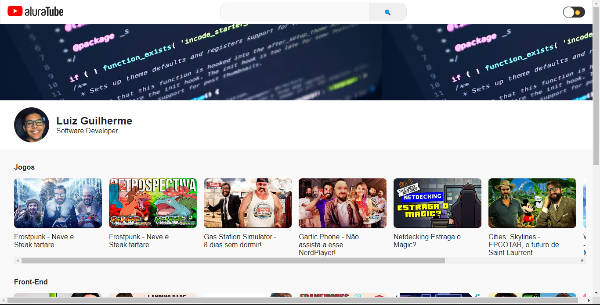

<h1 align="center"> AluraTube </h1>

  <a href="#-tecnologias">Tecnologias</a>&nbsp;&nbsp;&nbsp;|&nbsp;&nbsp;&nbsp;
  <a href="#-projeto">Projeto</a>&nbsp;&nbsp;&nbsp;|&nbsp;&nbsp;&nbsp;
  <a href="#-layout">Layout</a>&nbsp;&nbsp;&nbsp;|&nbsp;&nbsp;&nbsp;
  <a href="#memo-licença">Licença</a>

  

 

  

## 🚀 Tecnologias

Esse projeto foi desenvolvido com as seguintes tecnologias:

- NextJs
- React
- Styled Components
- HTML e CSS
- JavaScript

## 💻 Projeto

AluraTube é um projeto desenvolvido durante a imersão react da alura e tem como propósito ser ter uma UI clone do Youtube e suas principais features são o Dark Mode e a barra de pesquisa de vídeos.

## :memo: Licença

Esse projeto está sob a licença MIT.

---

Feito com ♥ by Luiz :wave:
